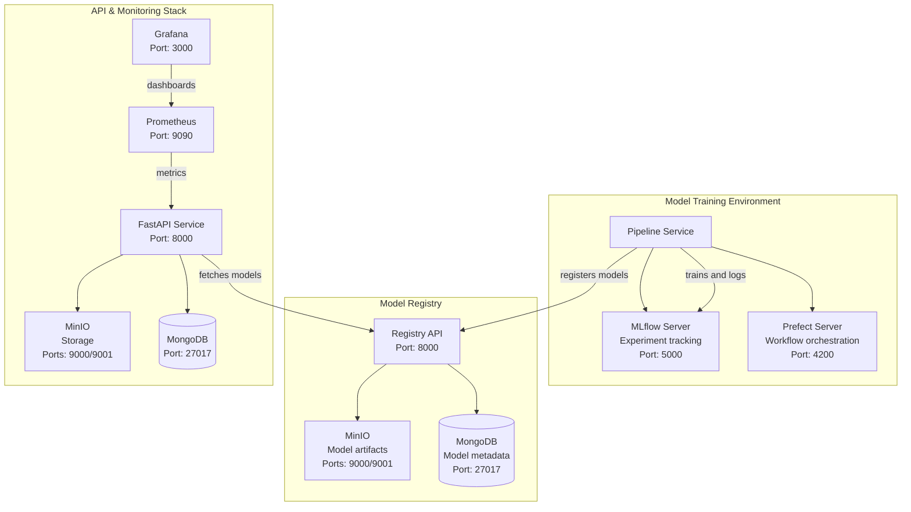

A production-ready machine learning system implementing end-to-end ML workflows with model training, registry, and prediction services with comprehensive monitoring capabilities.

## Overview

- **MLkit Package**: Core ML pipeline package for training, deployment, and model management
- **Training Environment**: MLflow and Prefect-based pipeline for model training and deployment
- **Model Registry**: Centralized model storage and versioning with MinIO and MongoDB
- **API Service**: FastAPI-based prediction service with Redis caching and monitoring
- **Tech Stack**: FastAPI, MLflow, Prefect, MongoDB, MinIO, Redis, Prometheus, Grafana

## Core Features

### ML Pipeline System

- **Write as package**: After notebook development, all codes and processes write as packages, (Add more useful exğlation)
  - Reusable and scalable
  - Test code and system
  - Dynamic object creation to data preparation


- **MLkit Package**: Comprehensive toolkit for ML operations
  - Training pipeline management
  - Model deployment automation
  - Feature engineering utilities
  - Experiment tracking integration

- **Pipeline Orchestration**
  - Three main pipelines:
    1. Feature Pipeline: Feature engineering and store updates
    2. Training Pipeline: Model training and evaluation
    3. Deployment Pipeline: Model conversion and registration
    4. Materialize Pipeline: Update feature store for api side
  - Configuration-driven pipeline management using YAML
  - Prefect-based workflow orchestration
  - MLflow experiment tracking and model logging

### Model Management
- **Training & Experimentation**
  - MLflow experiment tracking
  - Model performance logging
  - Hyperparameter management
  - Artifact storage

- **Model Registry**
  - Three-tier architecture:
    1. Registry API: Model management interface
    2. MongoDB: Metadata storage
    3. MinIO: Model artifact storage
  - Model versioning and lifecycle management
  - ONNX model conversion support

### Prediction Service
- FastAPI-based REST API
- Redis integration for online feature serving
- MinIO for prediction data storage
- MongoDB for request logging
- Comprehensive monitoring with Prometheus and Grafana


## Project Analysis Notes
- Development is based OOP
- Use Absttract Factory Pattern for dynamic object creation

###  Code Structure and Standards ✅

```python
# Abstract base classes for interfaces
class DataFrameAdapter(ABC, Generic[DF]):
    @abstractmethod
    def read_file(self, path: Path, file_format: str, **kwargs) -> DF:
        pass

# Concrete implementations
class PolarsAdapter(DataFrameAdapter[pl.DataFrame]):
    def read_file(self, path: Path, file_format: str, **kwargs) -> pl.DataFrame:
        readers = {"csv": pl.read_csv, "parquet": pl.read_parquet}
        return readers[file_format](path, **kwargs)
```

#### Error Handling
```python
def process(self, df: DF) -> Tuple[DF, Dict[str, Any]]:
    try:
        logger.info("Starting data processing")
        result = self._process_implementation(df)
        logger.info("Processing completed successfully")
        return result
    except Exception as e:
        logger.error(f"Processing failed: {str(e)}")
        raise
```

```python
class MLAdapter(Generic[M]):
    def __init__(self, config: ModelConfig):
        self.adapters = {
            "xgboost": XGBoostAdapter,
            "lightgbm": LightGBMAdapter,
            "random_forest": RandomForestAdapter,
        }
```

### 2. Configuration-Driven Design

- Type-safe configurations
- Environment-specific settings
- Easy experiment management
- Clear parameter documentation


### Logging
```python
logger = create_logger()
logger.info("Starting the application")

```
- save logs as default logs folder as mlkit.logs


### Make File

- All control project by make is purpose of development.

```bash
# Start all services
make start

# Start specific services
make start-training

# clean all cache file
make clean-file

```


## System Architecture



## Project Structure

```
.
├── mlkit/                  # ML Pipeline Package
├── api/                   # API Service
├── registry/             # Model Registry Service
├── project/              # Project-specific code
├── data/               # Data folder as raw and processed
├── mlops/                # Deployment configs
├── notebooks/            # Notebook file to improve the model and solutions
├── tests/               # Test suite
├── docs/                # Documentation
├── Makefile            # Build automation
└── .env                # Environment variables
```

## Service Architecture

### API Services (Prediction Stack)
| Service | Port | Purpose |
|---------|------|---------|
| FastAPI | 8888 | Main prediction API |
| MinIO | 9003 | Model storage |
| MongoDB | 27018 | Service data |
| Redis | 6379 | Feature cache |

### Model Registry Stack
| Service | Port | Purpose |
|---------|------|---------|
| Registry API | 8000 | Model management |
| MinIO | 9004 | Artifact storage |
| MongoDB | 27019 | Metadata storage |

### Training Stack
| Service | Port | Purpose |
|---------|------|---------|
| MLflow | 5000 | Experiment tracking |
| Prefect | 4200 | Workflow orchestration |

### Monitoring Stack
| Service | Port | Purpose |
|---------|------|---------|
| Prometheus | 9090 | Metrics collection |
| Grafana | 3000 | Visualization |


## Quick Start

### Prerequisites
- Docker
- Docker Compose
- uv
- python = 3.11.5

### Installation
you can use uv and or pip to install the dependencies

```bash
# uv version, install all package to test the project
uv sync

# pip3 version
pip install -r mlops/requirements.txt

```

### Running Services
```bash
# Start all services
make start

# Start specific services
make start-training
make start-registry
make start-api

# Stop services
make stop
```

### Development
```bash
# Format code
make format

# Run linting
make lint

# Clean cached files
make clean-file
```

## Configuration

### Environment Variables (.env)
```dotenv
# Service Ports
API_PORT=8888
REGISTRY_PORT=8000

# Storage Configuration
API_MINIO_PORT=9003
API_MONGODB_PORT=27018

# Security (Example values)
MONGODB_ROOT_USERNAME=root
MINIO_ACCESS_KEY=minioadmin
```

### ML Pipeline Configuration (config.yaml)
```yaml
tracking:
  experiment_name: "customer_purchases"
  tracking_uri: "http://mlflow:5000"

model_config:
  model_type: "xgboost"
  task_type: "regression"
```

## Monitoring & Observability

### Metrics Collection
- API performance metrics
- Model prediction latency
- Resource utilization
- Error rates

### Visualization
- Grafana dashboards (Port 3000)
- Real-time monitoring
- Custom alert rules

## Security Features
- Network isolation
- Service authentication
- Secure credential management
- Access control policies

## Contributing
1. Follow PEP 8 style guide
2. Add tests for new features
3. Update documentation
4. Submit pull request

## Important Notes


```python
# config load 
config_path = "config/pp_ml.yaml"
config = Config.load(config_path)

# load data
data = load_data(config=config,data_engine=data_engine)

